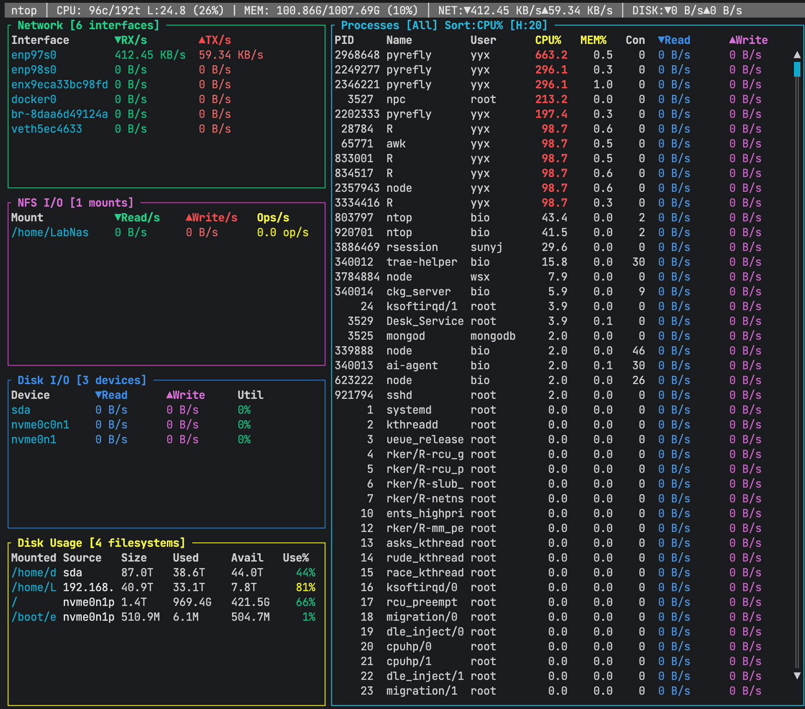

# ntop



[](LICENSE)


A real-time system resource monitor for Linux, inspired by htop but focused on network and disk I/O monitoring.

## Features

- **System Overview**: Real-time CPU (cores/threads/load) and memory usage in header
- **Network Monitoring**: Track RX/TX rates per network interface with scrollable list
- **NFS I/O Statistics**: Monitor NAS/network filesystem I/O operations
- **Disk I/O Statistics**: Monitor read/write rates per physical device
- **Disk Usage Display**: View filesystem usage (like `df -h`) with adaptive column widths
- **Process Monitoring**: CPU%, MEM%, disk I/O, connections per process with horizontal scrolling
- **User Statistics**: Aggregate resource usage by user (press `t`)
- **Process Details**: View detailed process info including command line, status, threads (press `Enter`)
- **Interactive Filtering**: Filter processes by username or PID
- **Multi-sorting**: Sort processes by CPU, MEM, READ, WRITE, CONN, or PID
- **Responsive UI**: Smooth scrolling with keyboard navigation

## Installation

### From Source

```bash
git clone https://github.com/WangLabCSU/ntop.git
cd ntop
cargo build --release
sudo cp target/release/ntop /usr/local/bin/
```

### Prerequisites

- Rust 1.70 or higher
- Linux kernel 2.6.33+ (for `/proc/diskstats` support)

## Usage

```bash
ntop
```

### Keyboard Shortcuts

| Key | Action |
|-----|--------|
| `q` | Quit |
| `Tab` | Cycle focus between panels |
| `↑`/`k` | Move up / Scroll up |
| `↓`/`j` | Move down / Scroll down |
| `←` | Horizontal scroll left (Processes panel) |
| `→` | Horizontal scroll right (Processes panel) |
| `Enter` | Show process details |
| `t` | Show user statistics |
| `u` | Filter by username |
| `p` | Filter by PID |
| `c` | Clear filter |
| `s` | Cycle sort order |
| `h`/`?` | Show help |
| `Esc` | Clear filter / Close popup |

### Panel Navigation

The UI is divided into panels that can be focused using `Tab`:

1. **Network** - Network interface statistics
2. **NFS I/O** - NFS mount I/O statistics (if present)
3. **Disk I/O** - Physical disk I/O statistics
4. **Disk Usage** - Filesystem usage information
5. **Processes** - Process list with resource usage

When a panel is focused, its border is highlighted and you can scroll its contents.

### Sort Order

Press `s` to cycle through:
1. CPU% (default)
2. MEM%
3. READ (read bytes/sec)
4. WRITE (write bytes/sec)
5. CONN (connections)
6. PID

### User Statistics

Press `t` to view resource usage aggregated by user:
- Process count per user
- Total CPU% per user
- Total MEM% per user
- Total read/write rates
- Total connections

### Process Details

Select a process in the Processes panel and press `Enter` to view:
- Full command line
- Process status (Running, Sleeping, etc.)
- Parent PID
- UID/GID
- Thread count
- Virtual and physical memory
- Executable path
- Working directory

## Data Sources

ntop reads from the following Linux `/proc` files:

- `/proc/loadavg` - System load average
- `/proc/meminfo` - Memory statistics
- `/proc/cpuinfo` - CPU information
- `/proc/net/dev` - Network interface statistics
- `/proc/net/rpc/nfs` - NFS client statistics
- `/proc/diskstats` - Disk I/O statistics
- `/proc/mounts` - Filesystem mount information
- `/proc/[pid]/stat` - Process CPU, memory, and state info
- `/proc/[pid]/status` - Process detailed status
- `/proc/[pid]/io` - Process I/O statistics
- `/proc/[pid]/cmdline` - Process command line
- `/proc/[pid]/fd/` - Process file descriptors (for connection counting)

## Architecture

```
ntop/
├── src/
│   ├── main.rs       # Application entry point and event loop
│   ├── system.rs     # System information (CPU, memory, load)
│   ├── network.rs    # Network statistics collection
│   ├── disk.rs       # Disk I/O and usage collection
│   ├── nfs.rs        # NFS I/O statistics collection
│   ├── process.rs    # Process statistics collection
│   └── ui.rs         # Terminal UI rendering
├── Cargo.toml
└── README.md
```

## Platform Support

- **Linux**: Full support
- **macOS**: Not supported (requires `/proc` filesystem)
- **Windows**: Not supported

## Development

### Running Tests

```bash
cargo test
```

### Running with Debug Output

```bash
RUST_LOG=debug cargo run
```

### Building Release

```bash
cargo build --release
```

## Contributing

1. Fork the repository
2. Create your feature branch (`git checkout -b feature/amazing-feature`)
3. Commit your changes (`git commit -m 'Add amazing feature'`)
4. Push to the branch (`git push origin feature/amazing-feature`)
5. Open a Pull Request

## License

This project is licensed under the MIT License - see the LICENSE file for details.

## Acknowledgments

- Inspired by [htop](https://htop.dev/) and [btop](https://github.com/aristocratos/btop)
- Built with [ratatui](https://github.com/ratatui-org/ratatui) for terminal UI
